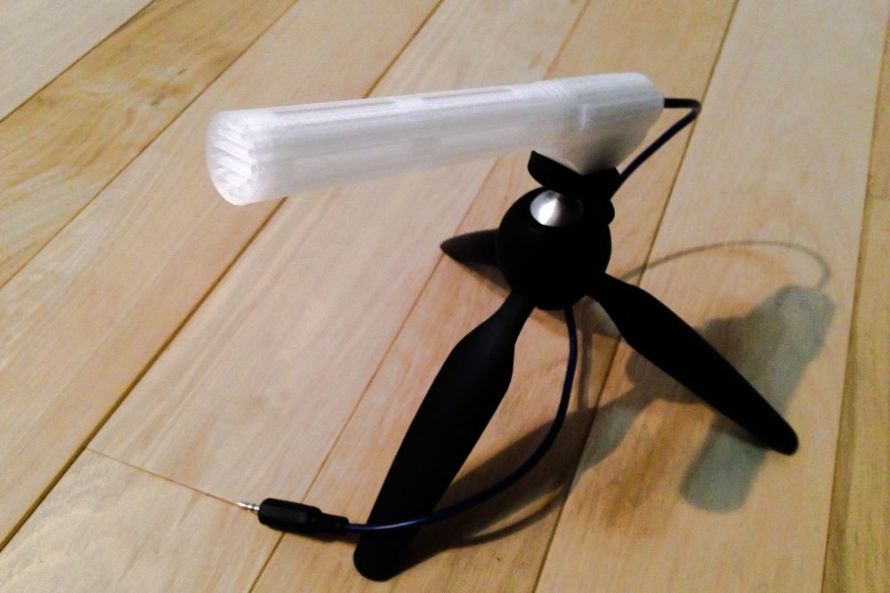
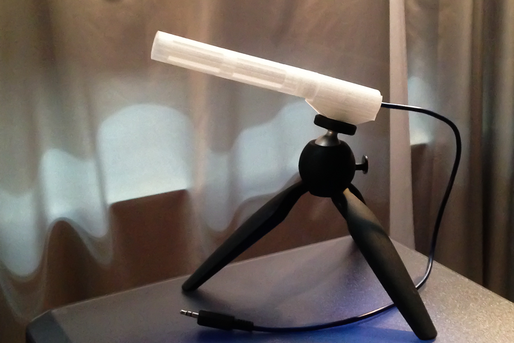
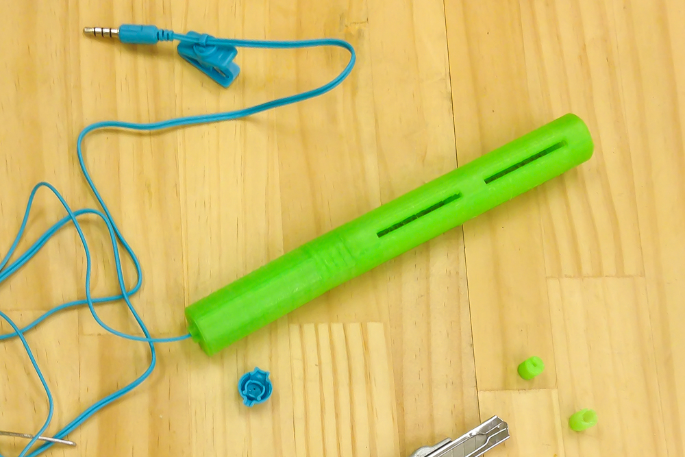
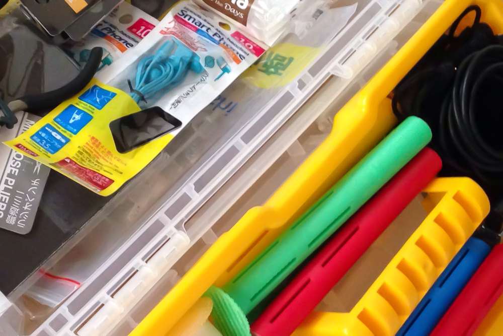
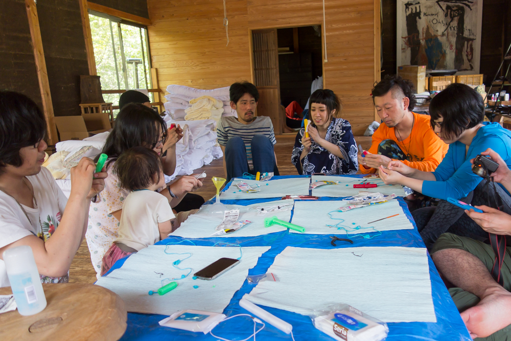
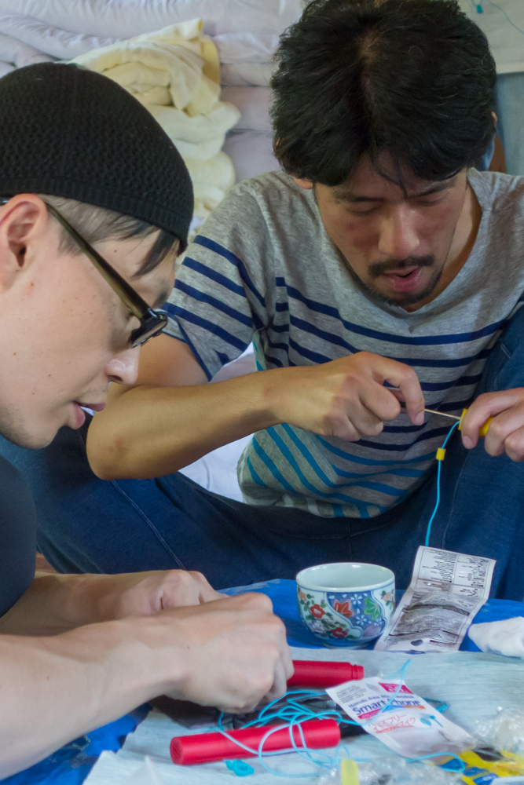
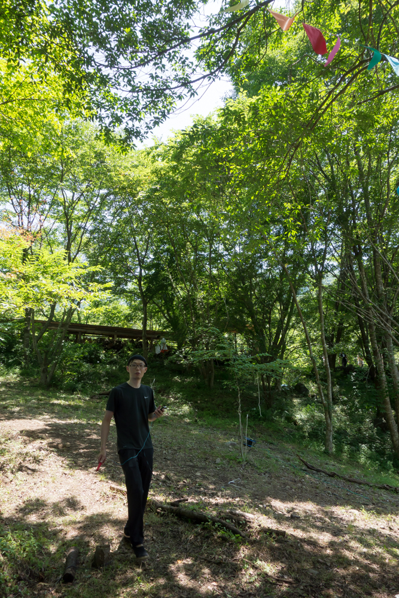
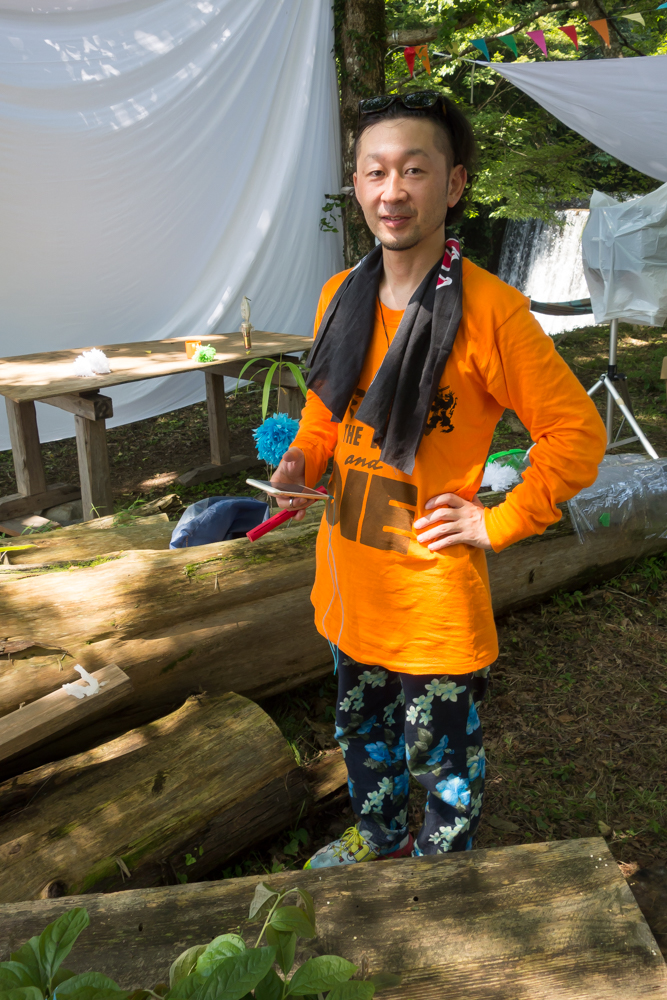
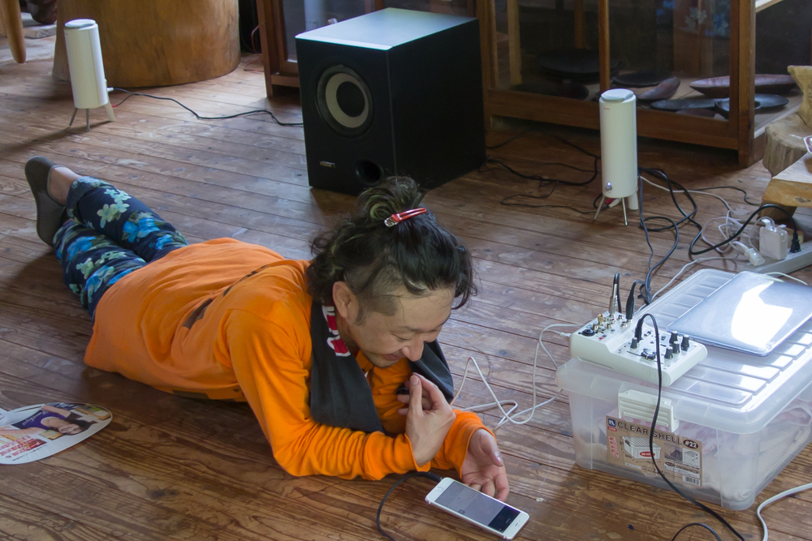
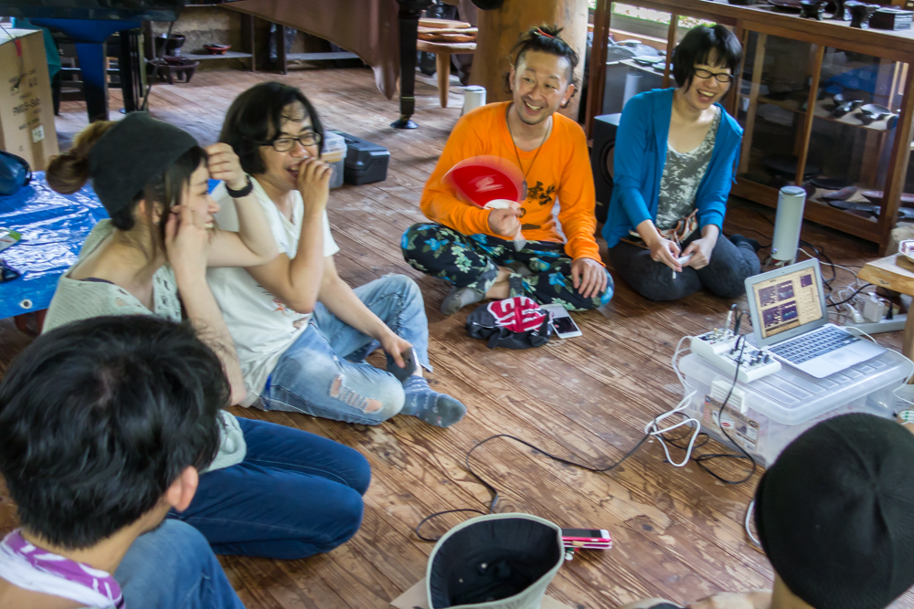

#NCS Microphone Project

  

This project is OPEN SHARED as open source hardware.  
See details and licenses on the website of each content.   
So you can make or update it by yourself.   
Looking foward to see your feedback!!  
  
(Project Adviser: [Masasi Heirakuji](http://www.grecord.com))  
(a derivative project of "[Spear Microphone Project](https://github.com/yosukesakai/Spear_Michrophone_Project)")  

--

###Goal:  

- to Self-Build Microphone 
- to Make Colorful Microphone  
*Sound Equipment can have More Color?*
- to Enjoy Sound around the World through an Experience with this Microphone
- and ENJOY IT!!

###How to Make:
   
  
####Instruction A: [NCS Microphone](http://fabble.cc/yosukesakai/ncs-microphone) (Fabble)    
Regular version.  
Print model parts with 3D printer and get some parts  in market, then build it.  

  

####Instruction B: [NCS Microphone (100 yen smartphone headset ver.)](http://fabble.cc/yosukesakai/ncs-microphone-100yen-smartphone-headset-ver) (Fabble)  
This is a variation of using a smartphone headset which is available in market, assembling 3d printed parts which are same as regular version.  
You can make it **WITHOUT ANY SOLDERING** and use it as regular external microphone of smartphone.

  
 
####STL file: [NCS Microphone](http://www.thingiverse.com/thing:1666150) (Thingiverse)  

STL file for body parts (tube part, bottom part, cable stopper) and optional parts.

###Sound Sample:  
#####*Bishanohana* (fieldrecording)  
[recorded with NCS Microphone (100 yen smartphone headset ver.) + iPhone](https://w.soundcloud.com/player/?url=https%3A//api.soundcloud.com/tracks/272745045&amp;color=ff5500&amp;auto_play=false&amp;hide_related=false&amp;show_comments=true&amp;show_user=true&amp;show_reposts=false)  

<iframe width="100%" height="166" scrolling="no" frameborder="no" src="https://w.soundcloud.com/player/?url=https%3A//api.soundcloud.com/tracks/272745045&amp;color=ff5500&amp;auto_play=false&amp;hide_related=false&amp;show_comments=true&amp;show_user=true&amp;show_reposts=false"></iframe>

*for reference*  
[recorded with audio-technica AT9944 + iPhone](https://w.soundcloud.com/player/?url=https%3A//api.soundcloud.com/tracks/272742016&amp;color=ff5500&amp;auto_play=false&amp;hide_related=false&amp;show_comments=true&amp;show_user=true&amp;show_reposts=false)  
<iframe width="100%" height="166" scrolling="no" frameborder="no" src="https://w.soundcloud.com/player/?url=https%3A//api.soundcloud.com/tracks/272742016&amp;color=ff5500&amp;auto_play=false&amp;hide_related=false&amp;show_comments=true&amp;show_user=true&amp;show_reposts=false"></iframe>

#####*Hinoyama* (fieldrecording)  
[recorded with NCS Microphone (100 yen smartphone headset ver.) + iPhone](https://w.soundcloud.com/player/?url=https%3A//api.soundcloud.com/tracks/272746818&amp;color=ff5500&amp;auto_play=false&amp;hide_related=false&amp;show_comments=true&amp;show_user=true&amp;show_reposts=false)  
<iframe width="100%" height="166" scrolling="no" frameborder="no" src="https://w.soundcloud.com/player/?url=https%3A//api.soundcloud.com/tracks/272746818&amp;color=ff5500&amp;auto_play=false&amp;hide_related=false&amp;show_comments=true&amp;show_user=true&amp;show_reposts=false"></iframe>

  
*for reference*  
[recorded with NCS Microphone (100 yen smartphone headset ver.) WITHOUT TUBE + iPhone](https://w.soundcloud.com/player/?url=https%3A//api.soundcloud.com/tracks/272745868&amp;color=ff5500&amp;auto_play=false&amp;hide_related=false&amp;show_comments=true&amp;show_user=true&amp;show_reposts=false)   
<iframe width="100%" height="166" scrolling="no" frameborder="no" src="https://w.soundcloud.com/player/?url=https%3A//api.soundcloud.com/tracks/272745868&amp;color=ff5500&amp;auto_play=false&amp;hide_related=false&amp;show_comments=true&amp;show_user=true&amp;show_reposts=false"></iframe>

###Workshop:

Making NCS Microphone and Fieldrecording Workshop was held at Hoshiniwa, Yaba-kei, Oita, JP. With 9 perticipants, Jul 2016.  
This workshop is supported by [FabLabYamaguchi](http://fablabyamaguchi.com).  

  
prepared parts  
  
  
make microphone  
  
  
make..  
  
  
record in field  
  
  
record..  
  
  
check recorded sound  
  
  
and listen together  
    
--

This is one of the Self-Build Microphone Project Series,   
  
- to experience self-building a microphone
- to turn attention to sound around daily life  
- to grow one's environment recognition some richer and ENJOY IT!  

Related projects  

[Spear Microphone Project](https://github.com/yosukesakai/Spear_Michrophone_Project)  
[NCS Microphone Project](https://github.com/yosukesakai/Spear_Michrophone_Project) (this project)  

next project is coming soon..

--  
